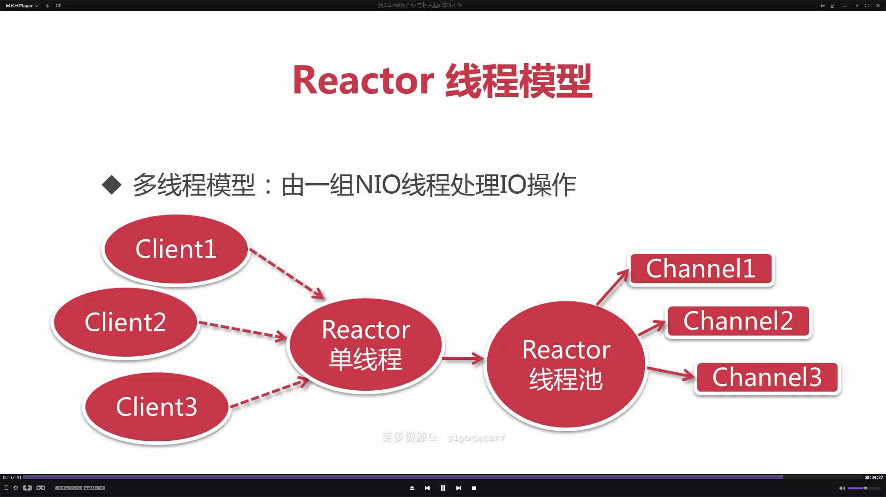

# Netty

BIO：阻塞IO

你去上厕所，发现坑满了，你会一直等。

 NIO：阻塞IO

你去上厕所，发现坑满了，你会去外面抽根烟，倒回来看有没有位置

说明：

​	当client想和server建立连接的时候，都要通过selector产生一个channel，一个selector可以处理成千上百个client，客户端的增多不会影响性能 。

 异步阻塞IO：基本上不用

你去上厕所，发现坑满了，你会在这里等着，让上完的人告诉你有位置了

异步阻塞IO：基本上不用

你去上厕所，发现坑满了，你不会在这里等着，做你自己的事，让上完的人告诉你有位置了

